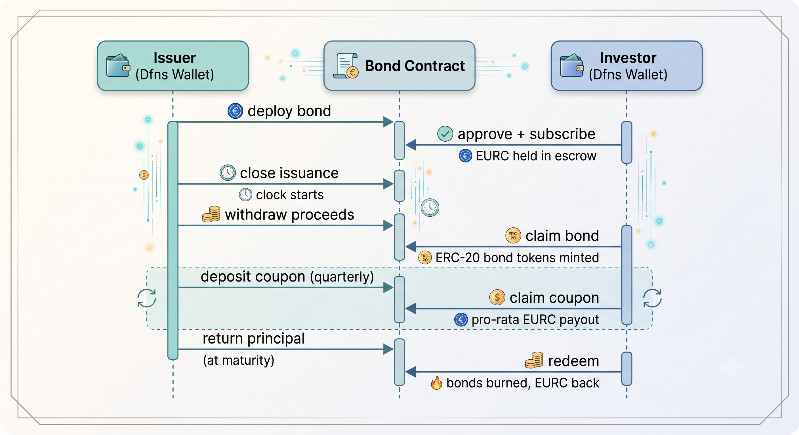

# Bond Issuance

Tokenized corporate bond lifecycle on **Ethereum**, secured by [Dfns](https://www.dfns.co/) wallets.

An issuer raises capital in Euro Stablecoins (EURC). Investors receive ERC-20 bond tokens representing their claim to periodic coupon payments and principal redemption at maturity. All on-chain transactions are signed through the Dfns KMS -- private keys never leave the Dfns infrastructure.

> **Full tutorial:** [docs.dfns.co/solutions/bond-issuance](https://docs.dfns.co/solutions/bond-issuance)

## Architecture

The system uses a **hybrid on-chain / off-chain** model:

- **On-chain settlement** -- all value transfers happen on-chain via smart contracts
- **Off-chain orchestration** -- scheduling and business logic live off-chain, with on-chain "pull" mechanisms for claiming



### Bond lifecycle

1. **Primary issuance** -- Investors subscribe by depositing EURC. Issuer closes issuance, locking the interest accrual clock.
2. **Coupon payments** -- Issuer funds each coupon period. Holders claim their pro-rata share: `(userBalance / totalSupply) * couponAmount`.
3. **Default protection** -- If a coupon is not funded within a 5-day grace period, anyone can trigger default.
4. **Redemption** -- At maturity, issuer deposits principal. Holders redeem: bonds are burned, original investment returned in EURC.

### Interest math

```
Accrued = (principal * APR * timeElapsed) / (365 days * 10000)
```

APR is expressed in basis points (400 = 4%). Stablecoin and bond tokens both use 6 decimals.

## Tech stack

- **Contracts**: Solidity 0.8.28 (OpenZeppelin, Hardhat v3)
- **Signing**: Dfns KMS via `@dfns/sdk`
- **Reads & broadcasts**: 100% Dfns API -- no separate RPC provider (see [No RPC node](#no-rpc-node) below)
- **Scripts**: TypeScript (tsx, viem -- used only for local ABI encoding, not for talking to the chain)
- **Web UI**: Single-page Express app with split Issuer/Investor dashboards
- **Stablecoin**: ERC-20 with mint/burn/pause (6 decimals)
- **Network**: Ethereum Sepolia

### No RPC node

Every on-chain read and write goes through the Dfns API instead of a raw JSON-RPC endpoint:

- **Contract reads** (balances, coupon schedule, status flags) use `dfnsApi.networks.callFunction`, Dfns's read-only contract-call passthrough -- see `readContract()` in [dfns.ts](scripts/dfns.ts).
- **Transactions** are signed and sent via `dfnsApi.wallets.broadcastTransaction`, then confirmed by polling `dfnsApi.wallets.getTransaction` until `status: "Confirmed"` -- see `broadcast()` in [dfns.ts](scripts/dfns.ts).
- **Bond maturity/coupon timing** uses wall-clock time (`Date.now()`) instead of a block timestamp -- the difference is immaterial against a coupon schedule measured in months.

One gap has no Dfns equivalent: **Dfns has no API that returns a deployment's resulting contract address** (that would normally come from an RPC receipt's `contractAddress` field). So after deploying the StableCoin or the Bond, you'll need to look up the address yourself (an Etherscan link is printed alongside the tx hash) and enter it when prompted -- in the CLI scripts via a prompt, in the web UI via a "paste address" field that appears after each deploy step.

## Quick start

### 1. Prerequisites

- Node.js v22+
- A [Dfns](https://www.dfns.co/) account with API credentials
- Two Dfns wallets on Ethereum Sepolia (one for the issuer, one for the investor)

### 2. Install

```bash
cd bond-issuance
npm install
```

### 3. Compile contracts

```bash
npm run compile
```

### 4. Run tests

```bash
npm test
```

Tests cover the full lifecycle: subscription, over/under-subscription, coupon claims, redemption, grace periods, default triggering, and interest math (including leap-year edge cases).

### 5. Configure environment

```bash
cp .env.example .env
```

Fill in your `.env`:

| Variable | Description |
|---|---|
| `DFNS_API_URL` | Dfns API base URL (default: `https://api.dfns.io`) |
| `DFNS_ORG_ID` | Your Dfns organization ID |
| `DFNS_AUTH_TOKEN` | Service account auth token |
| `DFNS_CRED_ID` | Credential ID for the signing key |
| `DFNS_PRIVATE_KEY` | Private key (PEM) for signing API requests |
| `ISSUER_WALLET_ID` | Dfns wallet ID for the bond issuer |
| `INVESTOR_WALLET_ID` | Dfns wallet ID for the investor |

### 6. Deploy and operate

**Deploy the stablecoin:**

```bash
npm run deploy:stablecoin
```

This prints a tx hash and an Etherscan link once the deploy confirms -- open the link to find the deployed contract address, since Dfns has no API to read that back directly.

**Mint stablecoin to the investor:**

```bash
npm run mint:stablecoin
```

**Deploy the bond:**

```bash
npm run deploy:bond
```

**Issuer operations** (close issuance, deposit coupons, return principal):

```bash
npm run ops:issuer
```

**Holder operations** (subscribe, claim bonds, claim coupons, redeem):

```bash
npm run ops:holder
```

**Stablecoin management** (mint, burn, pause):

```bash
npm run ops:stablecoin
```

### 7. Web UI

Run the web UI to walk through the full bond lifecycle from your browser:

```bash
npm run ui
```

Open [http://localhost:3000](http://localhost:3000). The UI shows two dashboards side by side — Issuer (blue) and Investor (green) — with numbered steps to follow in order. Each action calls the Dfns API to sign and broadcast transactions on Sepolia.

After the "Deploy StableCoin" and "Deploy Bond" steps, a tx link appears and the step waits for you to paste the deployed contract address into the input box before it marks itself done and unlocks the next step (again, because Dfns has no API to return this automatically).

### 8. End-to-end script

Run the full lifecycle (deploy, subscribe, close, coupon, claim):

```bash
npm run e2e
```

This is interactive at two points -- after each deploy step it prints a tx hash/Etherscan link and pauses for you to paste in the resulting contract address before continuing.

## CLI walkthrough

A typical end-to-end flow:

```bash
# 1. Deploy stablecoin
npm run deploy:stablecoin
# -> Open the printed Etherscan link to find the contract address

# 2. Mint EURC to investor wallet
npm run mint:stablecoin
# -> Enter stablecoin address, investor address, amount

# 3. Deploy bond (references stablecoin address)
npm run deploy:bond
# -> Configure: name, notional, APR, frequency, maturity, cap
# -> Open the printed Etherscan link to find the bond contract address

# 4. Investor subscribes
npm run ops:holder
# -> Option 2: Approve + Subscribe

# 5. Issuer closes issuance and withdraws proceeds
npm run ops:issuer
# -> Option 2: Close Issuance
# -> Option 3: Withdraw Proceeds

# 6. Investor claims bond tokens
npm run ops:holder
# -> Option 3: Claim Bond

# 7. Each coupon period: issuer deposits, investor claims
npm run ops:issuer    # -> Option 5: Deposit Coupon
npm run ops:holder    # -> Option 4: Claim Coupon (auto-detects due coupons)

# 8. At maturity: issuer returns principal, investor redeems
npm run ops:issuer    # -> Option 4: Return Principal
npm run ops:holder    # -> Option 5: Redeem
```

## Contracts

| Contract | Description |
|---|---|
| `Bond.sol` | ERC-20 bond token with full lifecycle: subscription, coupon, redemption, default |
| `BondMath.sol` | Library for accrued interest calculation |
| `StableCoin.sol` | ERC-20 stablecoin with mint/burn/pause and access control |

## License

MIT
