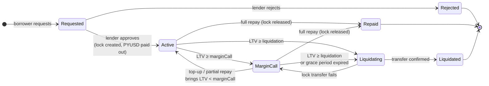
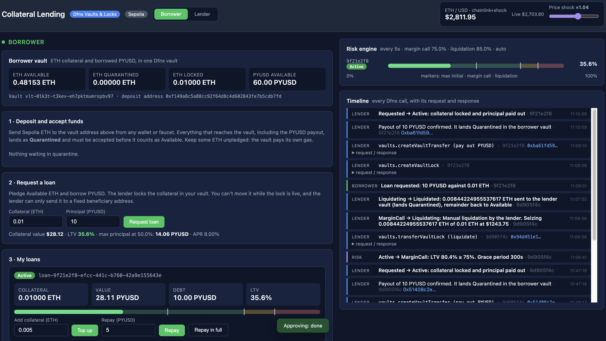
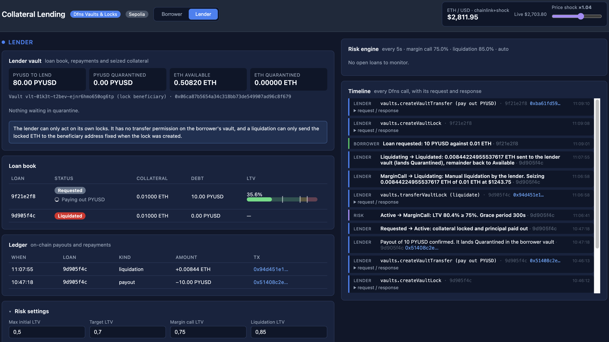

# Collateral Lending

Crypto-backed loans on **Ethereum Sepolia**, built on [Dfns](https://www.dfns.co/) **Vaults** and **Locks**.

A borrower pledges ETH held in their own Dfns vault and borrows **PYUSD**. The lender locks the collateral in the borrower's vault, pays out the loan and runs a risk engine on the loan-to-value ratio (LTV). If the ETH price falls, the engine raises a margin call. The borrower can then add collateral or repay. If they don't, the lender liquidates by transferring the lock to its own vault. Both actors hold everything in Dfns vaults. There are no plain wallets. Every movement of value is an on-chain transaction signed through Dfns: the deposit, the lock, the payout, repayments and liquidation.

One web page covers both actors (switch between Borrower and Lender), plus a shared risk panel and a timeline that shows the raw request and response of every Dfns call.

## How it works

### Who holds what

| Asset | Where it sits | Controlled by |
|---|---|---|
| ETH collateral | Borrower's **vault** | Borrower: deposits, accepts deposits, withdraws what is Available |
| The lock on that collateral | Borrower's vault | **Lender**, the lock's `owner` |
| PYUSD received, ETH for gas | Borrower's vault | Borrower |
| PYUSD treasury, seized ETH, ETH for gas | Lender's **vault**. Its address is the lock's `beneficiary` | Lender |

Each vault pays the gas for its own transfers, so neither can be drained to zero ETH. The borrower keeps `gasReserveEth` unpledged for repayments and lock transfers. Everything that reaches a vault lands as **Quarantined**: the payout, repayments and seized collateral all have to be accepted (`releaseQuarantine`) before they can be spent.

The collateral never leaves the borrower's custody unless the lender transfers the lock. A lock can only be released, replaced or transferred by the identity that created it. So while a loan is open, the borrower can't move the pledged ETH. The lender, in turn, can only send it to the `beneficiary` address fixed when the lock was created.

### Loan lifecycle



| Step | What happens on Dfns |
|---|---|
| Deposit | Anyone sends ETH to the borrower vault address on-chain. It lands as **Quarantined** |
| Accept deposit | `releaseQuarantine` moves it to **Available** |
| Approve loan | The lender creates a lock (`createVaultLock`), then pays out PYUSD with `createVaultTransfer` from its vault to the borrower vault. If the payout fails, the lock is released again |
| Top-up | `replaceVaultLock` raises the locked amount. This creates a new lock id |
| Repay | `createVaultTransfer` sends PYUSD from the borrower vault to the lender vault. A full repayment releases the lock (`releaseVaultLock`) |
| Liquidate | `transferVaultLock` sends debt + penalty worth of ETH to the lender vault. Dfns returns the rest to Available once the transfer confirms |
| Withdraw | `createVaultTransfer` moves Available ETH out of the borrower vault to an address the borrower gives |

### Risk engine

Every `riskIntervalSec` seconds (default 5), the engine does the following:

1. It reads the ETH/USD price.
2. It reads each open loan's locked amount back from Dfns (`getVaultLock`), so Dfns stays the source of truth.
3. It computes `LTV = debt / (locked ETH × price)`, where debt is the principal plus simple interest, minus repayments. PYUSD is valued at 1 USD.
4. It moves loans between Active, MarginCall and liquidation.

**Price sources:**

- `chainlink` reads the Sepolia ETH/USD Chainlink feed through Dfns's read-only contract-call API, so no RPC node is needed.
- `manual` uses a price you type in.
- `chainlink+shock` (the default) multiplies the live price by the **price shock** slider in the header. Drag it down to trigger a margin call without waiting for the market.

With `autoLiquidate` off, the engine flags the loan as *liquidation due* and waits for the lender to click. The server only allows the lender to liquidate during a margin call.

## Tech stack

- **Back-end:** TypeScript, Express 5, run with `tsx`. Loans are stored in `data/loans.json`.
- **Front-end:** one static HTML page with no build step. Live updates come over Server-Sent Events.
- **Dfns:** `@dfns/sdk` 0.8.31 with two service-account clients, `borrower` and `lender`.
- **Network:** Ethereum Sepolia. Collateral is native ETH and the loan asset is PYUSD (ERC-20, 6 decimals).
- **No smart contracts.** The collateral logic lives entirely in Dfns locks.

## Quick start

### 1. Prerequisites

- Node.js v22+
- A Dfns org with **Vaults** enabled
- Two **service accounts** in that org, one for the borrower and one for the lender. They must be separate identities, because only the lock's creator can act on it.

| Service account | Needs to be able to |
|---|---|
| `borrower` | Create and read vaults and vault addresses, release quarantines, create vault transfers, read transfers |
| `lender` | Create and read vaults and vault addresses, release quarantines, create vault transfers, create, replace, release and transfer vault locks, read transfers, call contract functions |

Both actors now need to create vault transfers, and Dfns permissions apply org-wide. Without a policy, the `lender` could therefore also send the borrower vault's **Available** (unlocked) funds. Locked collateral stays protected by the lock either way. Outside a demo, add a policy that limits each identity's vault transfers to its own vault.

### 2. Install

```bash
cd collateral
npm install
```

### 3. Configure credentials

```bash
cp .env.example .env
```

Fill in `DFNS_ORG_ID`, `DFNS_AUTH_TOKEN`, `DFNS_CRED_ID` and `DFNS_PRIVATE_KEY`. For the demo, the borrower and the lender share this one service account. The private key is the PEM for the credential. It can be multi-line in quotes, or on one line with `\n`.

`PYUSD_CONTRACT` is preset to Paxos's PYUSD test contract on Sepolia. Check it against the Paxos docs before you run the demo.

### 4. Create the Dfns resources

```bash
npm run setup
```

This creates the following and writes their IDs into `.env`:

- the borrower vault and its Sepolia address
- the lender vault and its Sepolia address

It's safe to re-run: anything already in `.env` is reused. If you created the vaults in the dashboard, put their `vlt-…` IDs in `.env` and the script only adds a Sepolia address where one is missing.

### 5. Fund the demo

The setup script prints the addresses to fund:

| Address | Fund with |
|---|---|
| Borrower vault | Sepolia ETH, for the collateral plus gas for repayments and lock transfers |
| Lender vault | PYUSD from the [Paxos faucet](https://faucet.paxos.com/), for the loan book, plus Sepolia ETH for gas |

Each deposit lands as Quarantined. Start the UI and accept them (the borrower and the lender each have a quarantine list) before going further.

Then give the borrower some PYUSD to cover interest. The borrower only ever receives the principal, so without this they couldn't repay in full:

```bash
npm run fund:buffer        # sends borrowerPyusdBuffer (default 50) PYUSD from the lender vault
```

The buffer also lands Quarantined in the borrower vault, so accept it there.

### 6. Run

```bash
npm start
```

Open [http://localhost:3000](http://localhost:3000). You can open a view directly with `#borrower` or `#lender`.

### 7. Walkthrough

1. **Borrower:** send Sepolia ETH to the vault address shown on the borrower view. Once the deposit confirms, it appears under *Waiting in quarantine*. Click **Accept** to make it Available.
2. **Borrower:** request a loan. The form shows the LTV as you type and blocks anything above `maxInitialLtv`.
3. **Lender:** click **Approve**. The timeline shows `createVaultLock`, then the PYUSD payout. The vault's *Locked* balance goes up, and the PYUSD shows up in the borrower's quarantine list. Accept it before repaying.
4. **Header:** drag **Price shock** down until the LTV crosses the margin-call line. The borrower sees a banner with the top-up needed and a countdown.
5. Next, either:
   - **Borrower:** top up or repay, and the loan goes back to Active.
   - Or wait: the loan is liquidated through `transferVaultLock`. The seized ETH lands Quarantined in the lender vault, and the remainder goes back to the borrower's Available balance.
6. On another loan, **repay in full**. The lock is released, and the borrower can withdraw the ETH.

The lender's **Risk settings** panel changes the thresholds, the APR, the grace period and the automation switches while the demo runs. The server checks that `maxInitialLtv ≤ targetLtv < marginCallLtv < liquidationLtv < 1`. Changes are saved to `data/config.json`, so the tracked `config.json` keeps the defaults.

## Configuration

`config.json` holds the defaults:

| Key | Default | Meaning |
|---|---|---|
| `maxInitialLtv` | 0.50 | A loan can't open above this LTV |
| `targetLtv` | 0.50 | The LTV that the suggested top-up brings the loan back to |
| `marginCallLtv` | 0.70 | Enter MarginCall at or above this |
| `liquidationLtv` | 0.85 | Liquidate at or above this |
| `liquidationPenaltyBps` | 500 | Extra 5% of the debt seized on liquidation |
| `aprBps` | 800 | 8% simple interest. Raise it to see interest move within a demo |
| `gracePeriodSec` | 300 | Time in MarginCall before a forced liquidation |
| `riskIntervalSec` | 5 | Risk engine tick |
| `priceSource` | `chainlink+shock` | `chainlink`, `manual` or `chainlink+shock` |
| `autoLiquidate` | true | Otherwise the lender liquidates by hand |
| `autoAcceptTopUp` | true | Otherwise the lender accepts each top-up |
| `gasReserveEth` | 0.002 | ETH in the borrower vault that can't be pledged, kept for gas |
| `borrowerPyusdBuffer` | 50 | PYUSD sent by `npm run fund:buffer` |

## REST API

The UI uses these endpoints, and you can call them directly with curl. Amounts are decimal strings in ETH or PYUSD, for example `"0.05"`.

| Method & path | Body | Purpose |
|---|---|---|
| `GET /api/state` | | Balances and quarantines of both vaults, loans, price, config, recent timeline |
| `GET /api/events` | | SSE stream: `timeline` entries and `tick` (price + loans) |
| `POST /api/borrower/quarantines/:id/release` | | Accept incoming funds in the borrower vault |
| `POST /api/lender/quarantines/:id/release` | | Accept incoming funds in the lender vault |
| `POST /api/borrower/loans` | `{ collateralEth, principal }` | Request a loan |
| `POST /api/borrower/loans/:id/topup` | `{ amountEth }` | Pledge more Available ETH |
| `POST /api/borrower/loans/:id/repay` | `{ amount }` or `{ full: true }` | Repay in PYUSD |
| `POST /api/borrower/withdraw` | `{ amountEth, to }` | Move Available ETH out of the vault |
| `POST /api/lender/loans/:id/approve` | | Lock the collateral and pay out |
| `POST /api/lender/loans/:id/reject` | | Decline a request |
| `POST /api/lender/loans/:id/accept-topup` | | Raise the lock when auto-accept is off |
| `POST /api/lender/loans/:id/liquidate` | | Manual liquidation, only during a margin call |
| `PUT /api/config` | settings patch | Change risk settings |
| `PUT /api/price/override` | `{ shock }` or `{ manualPriceUsd }` | Price shock / manual price |

## Tests

```bash
npm test          # LTV, interest, seizure and risk-transition math (node:test)
npm run typecheck
```

## UI Views

### Borrower's view



### Lenders' view

